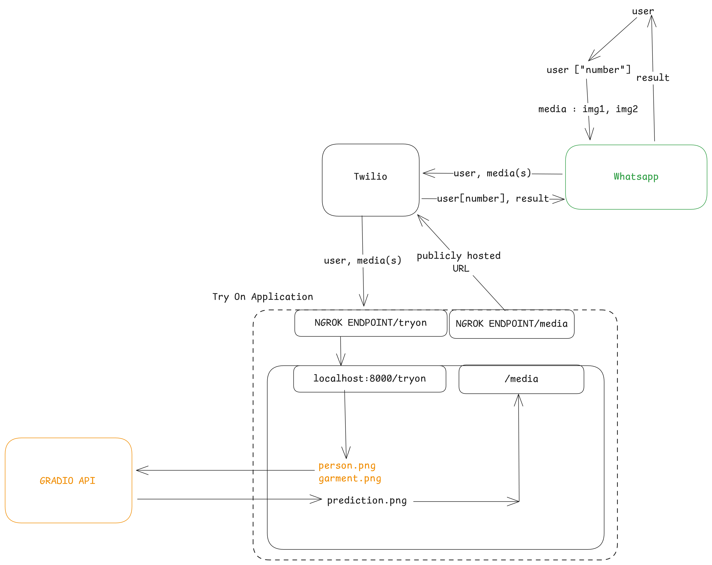

# Virtual Try-On Application

This is a virtual try-on application that allows users to upload their images and try on garments. The application integrates with Twilio for messaging and uses Gradio for virtual garment try-on. The process involves uploading a personal image and a garment image, followed by generating a prediction of the user wearing the garment.

## System Diagram



## Features

- **Twilio Integration**: Receive images via WhatsApp and SMS.
- **Image Processing**: Uses Gradio's Virtual Try-On model to generate predictions.
- **FastAPI Backend**: Handles image uploads, processing, and responses.
- **Local File Hosting**: Uses FastAPI's static file serving to host the generated images.
- **Prediction Generation**: Uses OpenCV and Gradio to generate and store the final try-on image.


## Installation

1. Clone the repository:

2. Install dependencies:

    ```bash
    pip install -r requirements.txt
    ```

3. Create a .env file with the following environment variables:
    ```ini
    TWILIO_ACCOUNT_SID=your_twilio_account_sid
    TWILIO_AUTH_TOKEN=your_twilio_auth_token
    NGROK_URL=your_ngrok_public_url
    ```

4. Set up Ngrok for tunneling to expose your local server to the internet:

    ```bash
    ngrok http 8080
    ```

5. Start the application:
    ```bash
    python3 -m uvicorn try_on.app:app --reload --port 8080
    ```

#### Usage
1. Send a WhatsApp message or SMS with an image of yourself (the person) to the Twilio number.
2. Once the person's image is received, the bot will ask for a garment image to try on.
3. After both images are uploaded, the application will process the images and send back a virtual try-on result with the user wearing the garment.


#### API Endpoints
- `GET /`: Returns a basic message indicating the API is working.
- `GET /media/{filename}`: Serves the media files (generated try-on images).
- `POST /tryon`: Receives images via Twilio and starts the try-on process.